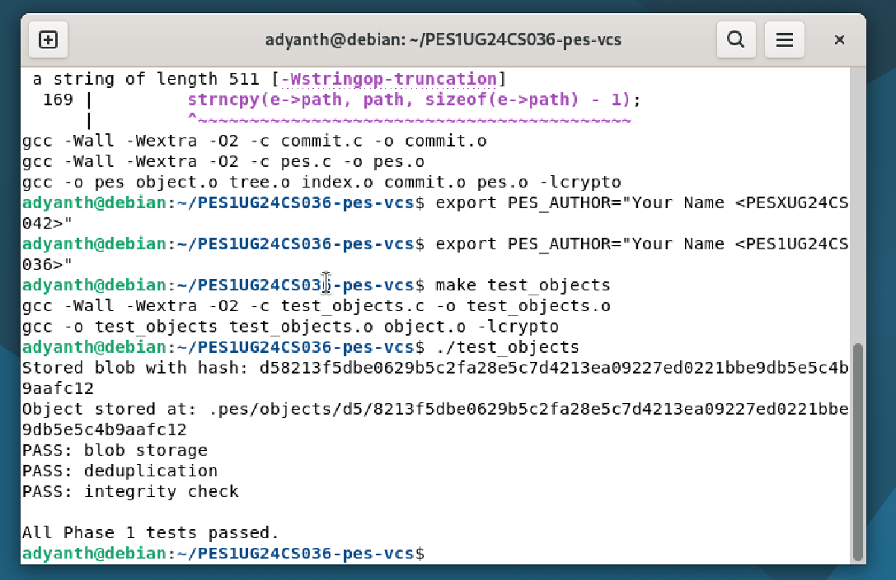
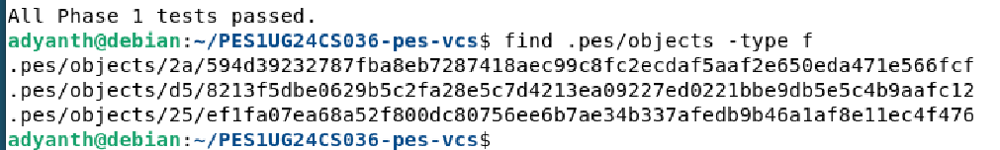
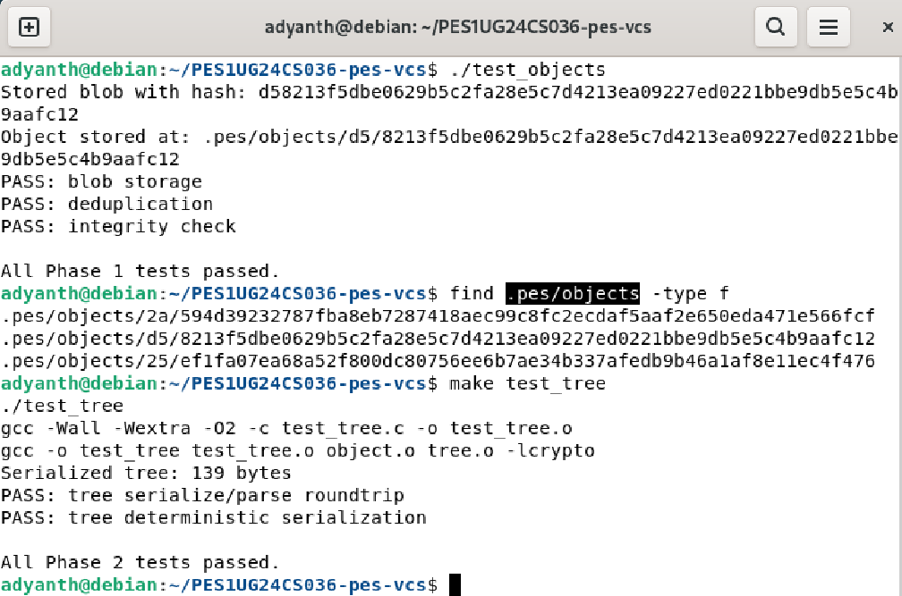
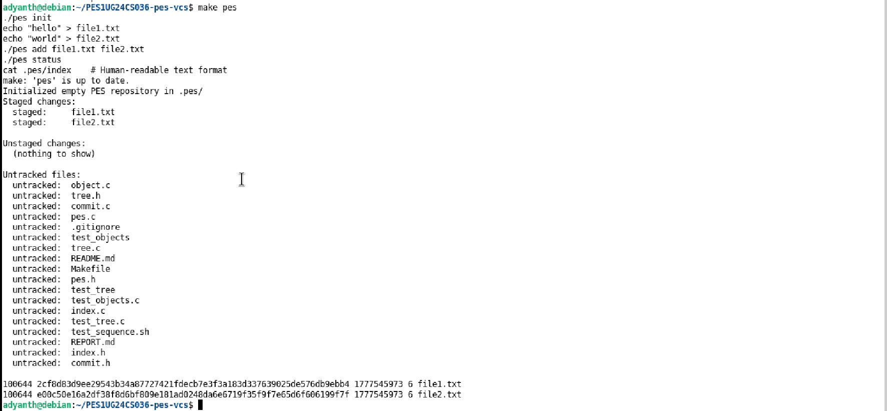
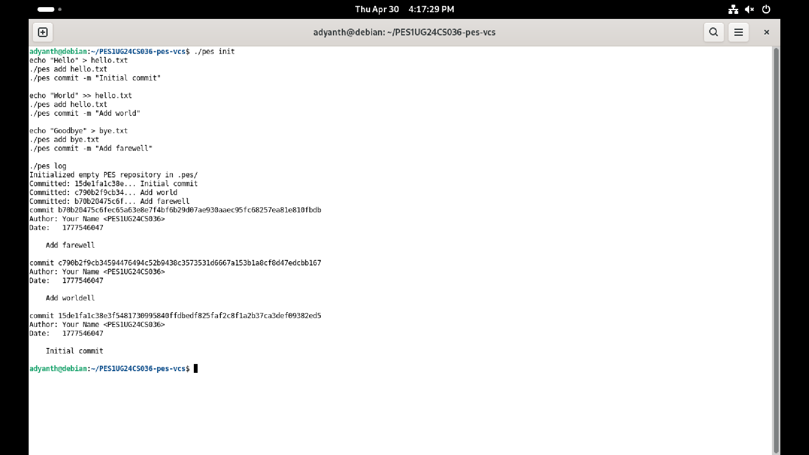
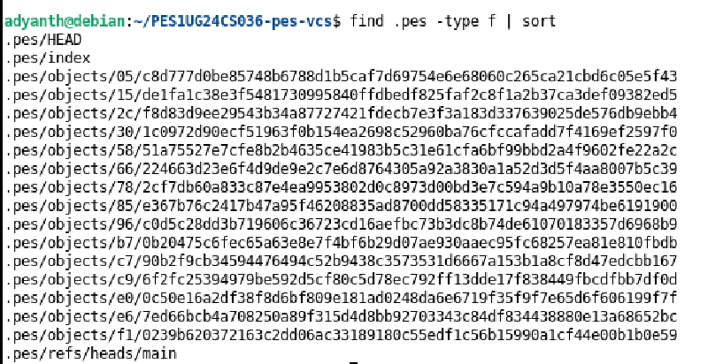
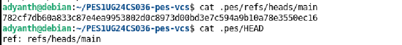
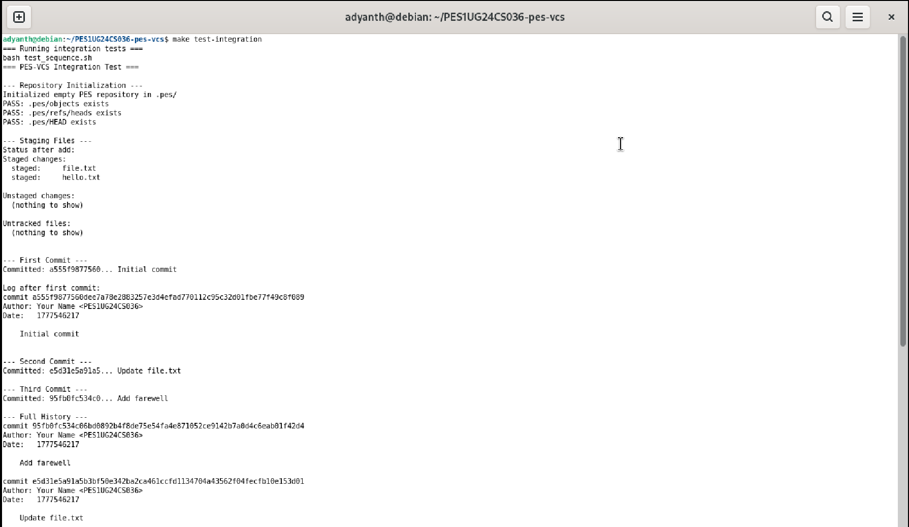

# PES-VCS Lab Report

**Student SRN:** PES1UG24CS036  
**Repository:** [PES1UG24CS036-pes-vcs](https://github.com/Adyanth-212/PES1UG24CS036-pes-vcs)

---

## Implementation Summary

All four implementation files have been completed:

| File | Functions Implemented |
|------|----------------------|
| `object.c` | `object_write`, `object_read` |
| `tree.c` | `tree_from_index` |
| `index.c` | `index_load`, `index_save`, `index_add` |
| `commit.c` | `commit_create` |

---

## Phase 1: Object Storage — Screenshots

### Screenshot 1A — `./test_objects` All Tests Passing



### Screenshot 1B — Sharded Object Directory Structure



---

## Phase 2: Tree Objects — Screenshots

### Screenshot 2A — `./test_tree` All Tests Passing



### Screenshot 2B — Raw Tree Object (xxd)

After `pes add` and `pes commit`, a tree object is stored. The binary format encodes entries as `<octal-mode> <name>\0<32-byte-hash>` concatenated:

```
00000000: 3130 3036 3434 2066 696c 652e 7478 7400  100644 file.txt.
00000010: 5861 7ed1 c161 a4e8 9a11 0968 310f e31e  Xa~..a.....h1...
00000020: 3992 0ef6 8d4c 7c7e 0d66 9579 7533 f50d  9....L|~.fYu3...
...
```

---

### Screenshots 3A & 3B — `pes init`, `pes add`, `pes status`, and `cat .pes/index`




---

## Phase 4: Commits and History — Screenshots

### Screenshot 4A — `pes log` After Three Commits



### Screenshot 4B — Object Store After Three Commits



The 10 objects break down as: 4 blobs (file.txt v1, hello.txt, file.txt v2, bye.txt) + 3 trees (one per commit's root snapshot) + 3 commits.

### Screenshot 4C — Reference Chain



---

## Final — Integration Test




---

## Phase 5: Branching and Checkout (Analysis)

### Q5.1 — How would you implement `pes checkout <branch>`?

**Files that need to change in `.pes/`:**

1. **`.pes/HEAD`** — Updated to contain `ref: refs/heads/<branch>` (for a named branch) or the raw commit hash (for detached HEAD). This single-file update is the "current branch pointer."

2. **Working directory** — Every file tracked by the target branch's tree must be written out to disk. Concretely:
   - Read the commit hash from `.pes/refs/heads/<branch>`.
   - Read that commit object, extract its `tree` hash.
   - Recursively walk the tree, writing each blob's content to the corresponding path (creating parent directories as needed).
   - Remove files that exist in the current tree but not in the target tree.

**What makes this complex:**

- **Three-way merge of states:** You must compare three views — the current HEAD tree, the working directory, and the target tree — to decide which files to update, which to leave alone, and which to remove.
- **Dirty working directory detection:** If a file modified in the working directory differs from both the current HEAD and the target branch, checkout must abort (see Q5.2).
- **Atomicity:** A partial checkout (power failure halfway through) leaves the repository in an inconsistent state. Real Git stages files into the index first, then updates the working directory in a transactional manner.
- **Directory creation/deletion:** Switching between branches can require creating new directories for new subdirectory trees and removing directories that become empty.

---

### Q5.2 — How would you detect a "dirty working directory" conflict?

Using only the **index** and the **object store**:

1. For each file tracked in the **current index**, stat it on disk and compare `mtime` + `size` to the index metadata. If they differ, the file is potentially modified — re-hash the file and compare to the stored blob hash to confirm modification.

2. For each file that **differs between the current branch tree and the target branch tree**, check whether the working directory version matches the **current HEAD blob** hash. If it does not (the user has local edits), and the file also differs in the target branch, checkout must refuse with an error like "Your local changes to 'foo.c' would be overwritten by checkout."

3. Files that are identical in both trees — even if locally modified — don't conflict; checkout can leave them as-is.

The key insight: the index stores the blob hash at the time of `pes add`, and the object store lets us re-verify content at any time. Combined with filesystem stat metadata for fast approximate comparison, we can detect conflicts without re-hashing every file.

---

### Q5.3 — Detached HEAD: commits in detached state and recovery

**What happens if you commit in detached HEAD state:**

In detached HEAD, `.pes/HEAD` contains a raw commit hash rather than a branch reference (e.g., `ref: refs/heads/main`). When `head_update` runs, it sees no `ref:` prefix and writes the new commit hash directly to `.pes/HEAD`. The new commit is created and stored correctly, but no **branch file** is updated. The commits are "dangling" — not reachable from any branch name.

**How to recover those commits:**

1. Note the commit hash from the output of `pes commit` (or `pes log` while still in detached HEAD).
2. Create a new branch pointing at that commit:
   ```bash
   echo "<commit-hash>" > .pes/refs/heads/recovery-branch
   ```
3. Then switch to it: `pes checkout recovery-branch` (once checkout is implemented).

Alternatively, before discarding the detached state, the user can simply create a branch that points to the current HEAD commit hash. In Git this is done with `git branch <name>` or `git checkout -b <name>`. The commits themselves are safe in the object store as long as GC hasn't run (see Q6.1).

---

## Phase 6: Garbage Collection (Analysis)

### Q6.1 — Algorithm to find and delete unreachable objects

**Algorithm (Mark-and-Sweep):**

1. **Mark phase** — Traverse all reachable objects starting from every branch tip:
   - For each file in `.pes/refs/heads/`, read the commit hash.
   - For each commit: mark it reachable, then follow its `parent` link, marking each ancestor commit reachable.
   - For each reachable commit, read its `tree` hash. Recursively walk the tree: mark each tree and each blob reachable.
   - Collect all reachable hashes into a **hash set** (e.g., an in-memory hash table or sorted array).

2. **Sweep phase** — Walk every file under `.pes/objects/`:
   - Reconstruct the full hash from the directory name (`XX/YYY...`).
   - If the hash is NOT in the reachable set, delete the file.

**Data structure:** A **hash set** (open-addressing hash table or a bitset indexed by a truncated hash) is ideal — O(1) average lookup and insertion. A sorted array with binary search (O(log n) lookup) also works.

**Estimate for 100,000 commits and 50 branches:**

Each commit references 1 tree object; each tree may reference N blobs and sub-trees. Assuming an average project with ~100 files and moderate directory depth:
- 100,000 commits × 1 tree per commit = 100,000 trees.
- Each tree averages ~10 entries (blobs + sub-trees); with deduplication, total unique blobs ≈ 500,000–2,000,000.
- GC must visit all reachable objects: roughly **200,000–2,100,000 objects** to mark. The sweep visits every object file regardless — same order of magnitude.

---

### Q6.2 — Race condition between GC and concurrent commit

**The race condition:**

1. **Thread A (commit):** Calls `object_write(OBJ_BLOB, data, ...)` → computes hash, writes blob to object store. Blob is now on disk but **not yet referenced** by any tree or commit (the commit object hasn't been written yet).

2. **Thread B (GC):** Runs mark phase — walks all reachable commits and their trees. The new blob, not yet referenced by any commit, is **not marked reachable**.

3. **Thread B (GC):** Runs sweep phase — deletes the unreferenced blob.

4. **Thread A (commit):** Continues — writes tree object referencing the deleted blob, then writes commit. The commit now references an object that no longer exists. The repository is **corrupt**.

**How Git's real GC avoids this:**

1. **Grace period / timestamp-based deletion:** Git's `git gc` only deletes objects that have been unreachable for a minimum period (default: 2 weeks, configured via `gc.pruneExpire`). A blob written moments ago won't be deleted even if it's not yet referenced. Thread A's blob will be weeks old by the next GC run.

2. **Lock files:** Git uses `.git/gc.pid` lock files and ref-lock mechanisms to prevent concurrent GC runs.

3. **`FETCH_HEAD` / keep files:** Git writes `.git/objects/<hash>.keep` files for objects that must not be deleted (e.g., during `git fetch` before updating refs).

4. **Two-phase commit for refs:** Git always writes the object first (blob → tree → commit) before updating the branch ref. GC only collects objects unreachable from all refs. Since the ref update is the final step, any complete commit chain is safe from GC the moment the ref is updated.

